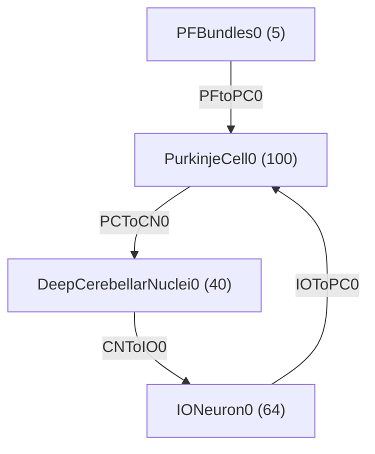

# Cerebellum JAX

This is a translation of the olivocerebellar loop model (Fernández Santoro et al, 2025)
translated by [Balint Magyar](https://github.com/mablin7/cerebellum-jax) to JAX/BrainPy.

## Usage

```python
net = CerebellarNetwork()

monitors = {
    "pc.V": net.pc.V,
    "cn.V": net.cn.V,
    "io.V_soma": net.io.neurons.V_soma,
}

runner = bp.DSRunner(net, monitors=monitors, dt=dt)
runner.run(duration)
```


## System Diagram

(generated from network model)



## Olivocerebellar Model Overview

The olivocerebellar model consists of four main components: Parallel Fiber (PF) bundles, Purkinje Cells (PCs), Cerebellar Nuclei (CN) neurons, and Inferior Olive (IO) neurons. The model forms a closed loop where these components interact through specific synaptic connections and plasticity mechanisms to produce bidirectional learning in the cerebellum.

### Neural Populations

#### 1. Parallel Fiber (PF) Bundles

PF bundles represent the input to the system, modeled as stochastic processes:

- **Number**: 5 PF bundles
- **Model**: Ornstein-Uhlenbeck (OU) process
- **Equation**:
  ```
  dI^(PF)_OU/dt = (I^(PF)_OU₀ - I^(PF)_OU)/τ^(PF)_OU + σ^(PF)_OU·ξ/√τ^(PF)_OU
  ```
  where ξ is a Gaussian random variable with mean μ = 0 and standard deviation σ = 1

#### 2. Purkinje Cells (PC)

- **Number**: 100 PCs
- **Model**: Adaptive exponential integrate-and-fire (AdEx)
- **Types**: Upbound (~60 Hz baseline) and Downbound (~90 Hz baseline)
- **Equations**:

  ```
  dV/dt = (1/C_m)[-g_l(V - V_l) + g_l·Δ_T·e^((V-V_T)/Δ_T) + ∑I^(i) - w]
  dw/dt = [a(V-V_l) - w]/τ_w
  ```

  At spike: `V = V_r; w += b`

  Where currents for PC are:

  ```
  ∑I_PC = I_PF + I^(PC)_int
  ```

#### 3. Cerebellar Nuclei (CN)

- **Number**: 40 CN neurons
- **Model**: Adaptive exponential integrate-and-fire (AdEx)
- **Equations**: Same as PC with different parameters

  Where currents for CN are:

  ```
  ∑I_CN = I^(CN)_int - I^(CN)_PC
  ```

#### 4. Inferior Olive (IO)

- **Number**: 40 IO neurons
- **Model**: Three-compartment model (somatic, dendritic, axonic)
- **Equations**:

  ```
  C_m·dV_s/dt = -∑I^(s) + I^(s)_app + I^(IO)_OU + I^(IO)_CN
  C_m·dV_d/dt = -∑I^(d) + I^(d)_app
  C_m·dV_a/dt = -∑I^(a)
  ```

  With calcium dynamics:

  ```
  d[Ca²⁺]/dt = -3.0·I_Ca_h - 0.075·[Ca²⁺]
  ```

  And activation/inactivation variables:

  ```
  dz/dt = (z_∞ - z)/τ_z
  ```

### Synaptic Connections

#### 1. PF to PC Connection

- **Connectivity**: Each PC receives input from 5 PF bundles
- **Type**: Excitatory with plasticity
- **Current calculation**:
  ```
  I_PF = (1/5)·∑_j I_j·w_j
  ```

#### 2. PC to CN Connection

- **Connectivity**: Each PC projects to 16 CN; Each CN receives from ~40 PCs (30-52)
- **Type**: Inhibitory
- **Synaptic dynamics**:
  ```
  dI^(CN)_PC/dt = -I^(CN)_PC/τ^(CN)_PC
  @PC spike: I^(CN)_PC += γ^(CN)_PC
  ```

#### 3. CN to IO Connection

- **Connectivity**: Each CN projects to 10 IO; Each IO receives from ~10 CN (6-16)
- **Type**: Inhibitory
- **Synaptic dynamics**:
  ```
  dI^(IO)_CN/dt = -I^(IO)_CN/τ^(IO)_CN
  @CN spike: I^(IO)_CN += γ^(IO)_CN/N_CN
  ```

#### 4. IO to PC Connection

- **Connectivity**: Half of IO cells project to PCs; Each projecting IO connects to ~5 PCs (2-9); Each PC receives from 1 IO
- **Type**: Excitatory, produces Complex Spikes (CSpks)
- **Effect**: Updates PC adaptation variable `w`
  ```
  @IO spike: w^PC += γ^(PC)_IO
  ```

#### 5. IO to IO Connection

- **Type**: Gap junctions (electrical coupling)
- **Current**:
  ```
  I_c = g_c(V_d - V_de)f(V_d - V_de)
  ```
  where f(V) is the gap junction conductance function:
  ```
  f(V) = 0.6e^(V²/50²) + 0.4
  ```

### Micromodule Types

#### 1. Upbound Micromodule

- PC intrinsic firing rate: ~60 Hz
- Propensity for potentiation
- Parameters tuned for this response

#### 2. Downbound Micromodule

- PC intrinsic firing rate: ~90 Hz
- Propensity for depression
- Parameters tuned for this response

The model demonstrates how these two types of micromodules, with their different intrinsic properties, can show bidirectional plasticity within the same network architecture, and how this plasticity stabilizes over time due to the loop dynamics.

## Citations

 - Fernández Santoro, Elías M., et al. "Homeostatic bidirectional plasticity in Upbound and Downbound micromodules of the olivocerebellar system." bioRxiv (2025): 2025-01.
 - Wang, Chaoming, et al. "BrainPy, a flexible, integrative, efficient, and extensible framework for general-purpose brain dynamics programming." elife 12 (2023): e86365.
